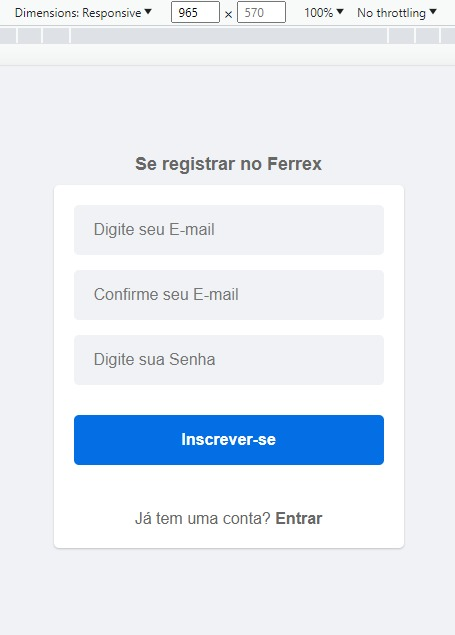
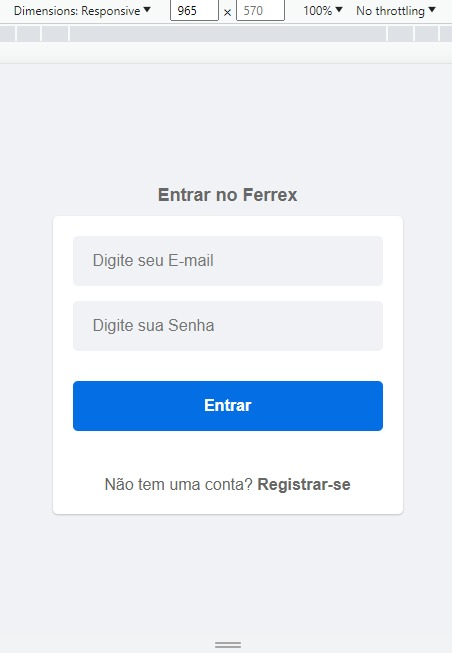
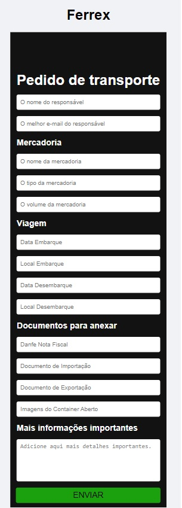
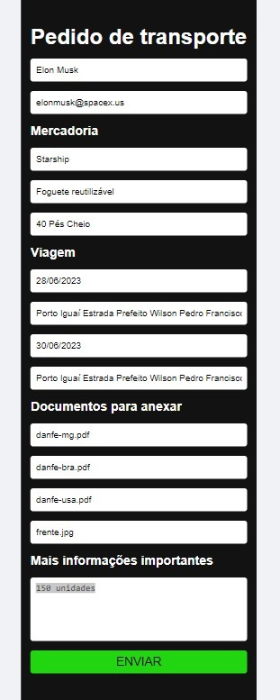
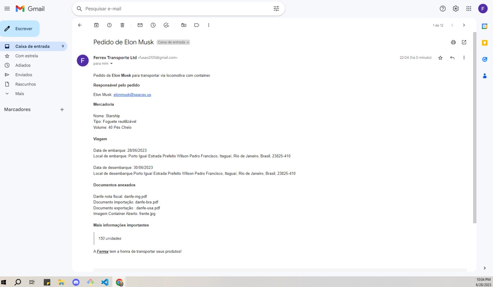

## Ferrex 

O desafio desse projeto é para uma página de login e cadastro.
Um formulário de pedido com informações importantes para enviar por email.

### Tarefas

- [ ] Página login
- [ ] Página register
- [x] Página pedido
- [ ] Identidade visual
- [ ] Responsividade
  
### Descrição de tarefas

#### Página login

- email e senha para entrar.

#### Página register

Informações do primeiro cadastro

#### Página pedido

- preencher informações de pedido, enviar email, resposta de enviado.
- ferramenta de disparo de emails, emailsJS.
- informações do primeiro cadastro

#### Identidade visual

- cores
- logo
- icon

#### Responsividade

- fluidez em smartphone e desktop.

### Gestão do projeto

- [ ] feature/login: Página login
- [ ] feature/register: Página register
- [ ] feature/pedido: Página pedido
- [ ] feature/identidade-visual: Identidade visual
- [ ] feature/responsividade: Responsividade

### Tecnologias

- NextJS
- Typescript
- Tailwindcss
- EmailJS

### Telas da aplicação
Estão na ordem do fluxo perfeito de uso.

- Registrar

   

 

- Entrar 

   

  

- Pedido de transporte

   

  

- Pedido preenchido

   

- Pedido recebido  

   

  

### Instruções de como usar

Como baixar, instalar as dependências e rodar o projeto na máquina local.

### Desenvolvedores

- Douglas A. B. Novato - @douglasabnovato
- João Pedro Garcia - @jpedro_g2